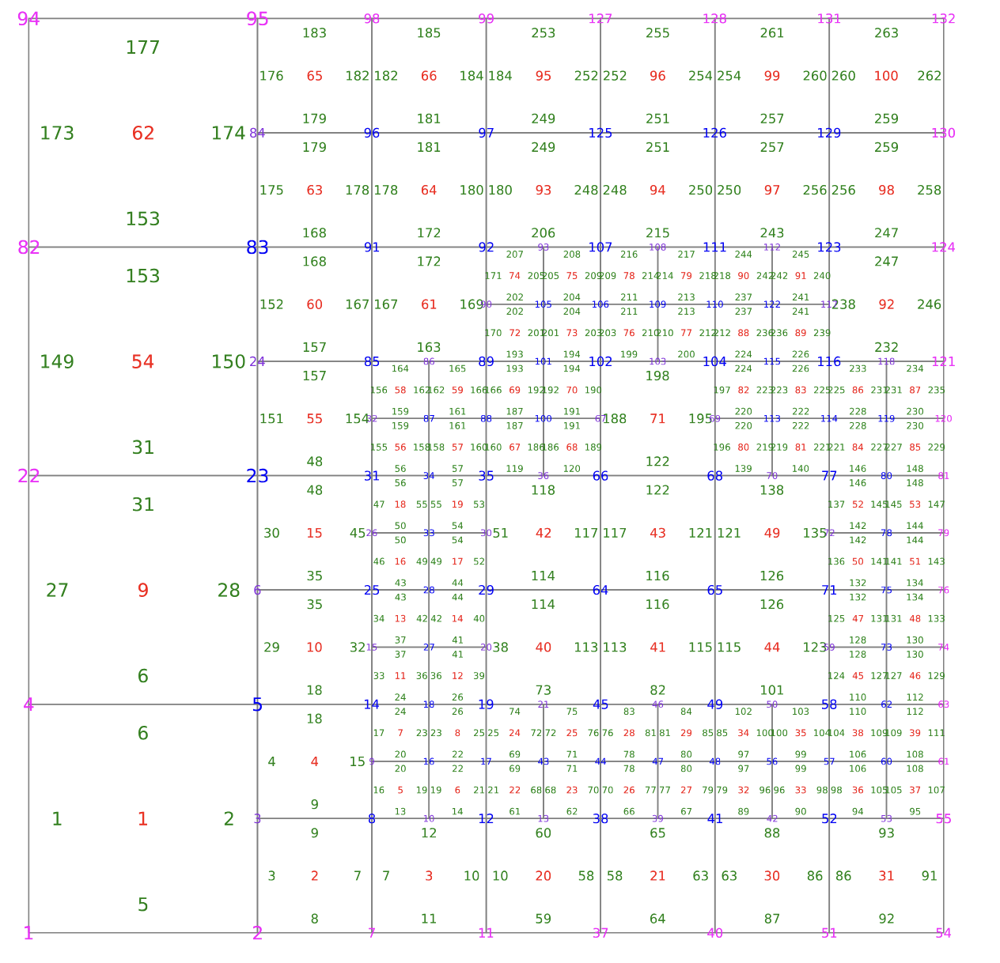
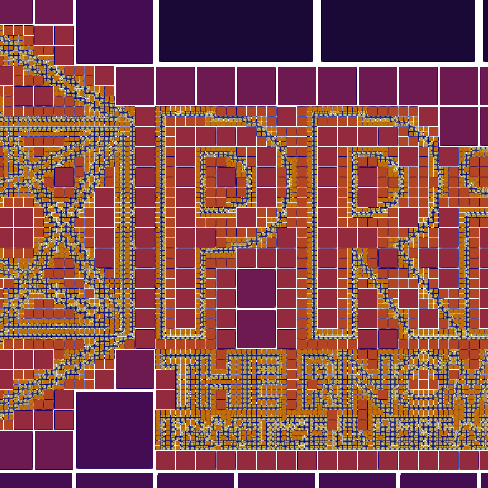

## Local Refinement in Computational Science and Music

*PRiSM Scientist-in-Residence 2021 Update* 

**Patrick Sanan, ETH Zurich**

Computational science has been called the "third pillar" of science, along with theory and experimentation. It allows insight into complex processes which cannot be understood with traditional laboratory experimentation or pure theory. By performing simulations which apply physical laws on large and/or complex domains,
understanding can be gained into the evolution of systems of great relevance. This is especially true in Earth and planetary science: an example relevant to my work is the question of how one models the formation and evolution of rocky planets over millions and billions of years, in an ongoing quest to better understand tantalizing facts such as that Earth is the only planetary body we've observed with plate tectonics  (except perhaps [Europa](https://www.jpl.nasa.gov/news/scientists-find-evidence-of-diving-tectonic-plates-on-europa), and also the only one with evidence of life.

To build a model, one chooses a suitably-realistic set of governing physical laws, described by a set of equations.  Then, one constructs a set of *discretized* equations which allow for the
the solution of a finite number of values, such as can be done with a computer or networked cluster of computers. One turns to the fields of applied and computational mathematics to find efficient methods of solution for these discrete systems, along with deep analysis to quantify the accurate of the generated solutions.

When modelling of systems such as the Earth, one quickly discovers that 
a very large number of degrees
of freedom (unknowns) are needed to describe the solution of interest. For instance, many processes in subduction (the sinking of tectonic plates back into the mantle) need velocity and other quantities to be resolved
at a resolution of 1km or less, yet partitioning the globe
into cells of that size would lead to an immensely large discrete system,
which even the largest supercomputers struggle with.

A way forward is to use *locally-refined meshes*, meaning that one uses smaller
cells in areas where high resolution is required, and larger cells elsewhere.
This requires more elaborate discrete systems and software to work with them,
but can allow fundamentally new questions to be answered, that were computaitonally
intractable before.

*By introducing the additional complexity required to manage operations
on locally-refined grids, computational methods can achieve higher overall accuracy with fixed computational resources*

These methods have an inherent beauty and elegance, in that they are all about balance:
allocating attention and effort where it is needed, and allowing sparsity elsewhere.
By using *adaptive mesh refinement*, they let the computational method adapt itself dynamically to the emerging solution of the problem,
which is of course not known ahead of time.

*Locally refined-meshes allow very high resolution at points of interest in a computaional domain, here driven to resolve boundaries in an image of the PRiSM logo (zoomed in)*

As part of the PRiSM Scientist in Residence Program,  I am working
with PRiSM composers, engineers, and researchers to explore how these elegant
mathematical and computational processes can be connected with sonic and musical expression.
My research involves working with researchers searching for solutions to geophysical flow problems (particularly mantle convection) which describe
slowly flowing rock in planets like Earth, and I am particularly interested
in new algorithms for efficienctly solving these flow problems on non-uniform
grids.

*A simple Stokes flow simulation calculated on a locally-refined grid driven by the PRiSM logo.*

These new algorithms and attendant visualizations are being developed into an
open-ended tool to be used by composers for inspiration and to directly generate
data from simulations. In parallel, a interactive audio-visual installation is being
developed which will use many of the same techniques, but with a physical
display and interaction component.

It is also hoped that this will be a two-way exchange, in that the resulting
tools, productions, and installation will allow audiences to appreciate
the computational algorithms and Earth Science applications in a new and direct way
that only art and music can access.

